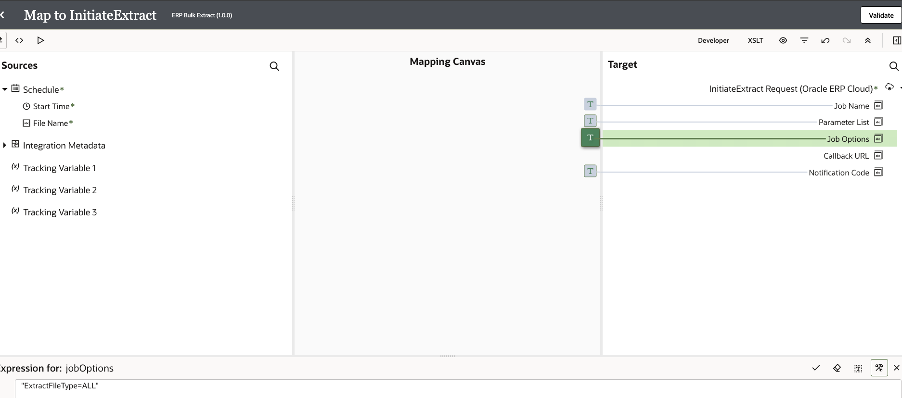
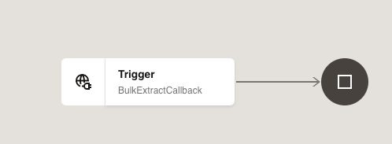
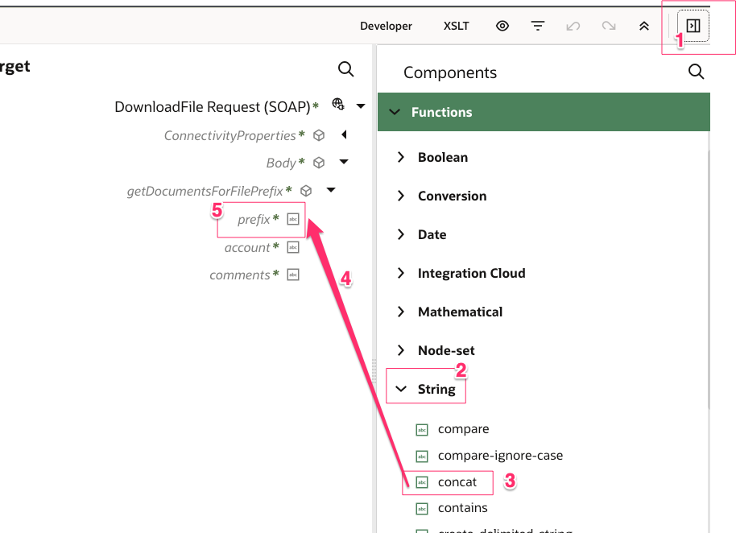
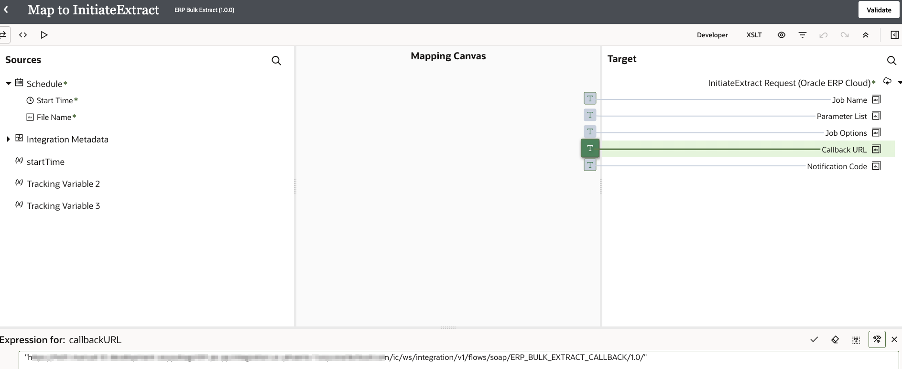

# Bulk Extract Integration Flow

## Introduction

This lab walks you through the steps to create a Bulk Extract Integration flow integrating with Oracle ERP Cloud.

This use case explores the use of Oracle Integration to extract large data sets from Oracle in an asynchronous fashion leveraging a callback mechanism.

This use case includes the following steps:

* Initiate Payables Transactions Process
* Listen to the callback message delivered from ERP cloud
* Finally, download the extract from UCM and deliver the data set to an SFTP location

 The following diagram shows the interaction between the systems involved in this use case.
     

Estimated Time: 60 minutes

### Objectives

In this lab, you will:

* Connect to ERP Cloud to extract the bulk data
* Understand how to extract bulk data from the Oracle ERP cloud in an asynchronous fashion leveraging ERP cloud adapter capabilities


### Prerequisites

This lab assumes you have:

* All previous labs successfully completed.

## Task 1: Create the ERP Bulk Extract Integration

1. In the left Navigation pane, click ***Design*** &gt; ***Integrations***.
2. On the **Integrations page**, click ***Create***.
3. On the **Create integration** dialog, select and click on ***Schedule***
4. In the **Create integration** dialog, enter the following information:

    | **Element**          | **Value**          |       
    | --- | ----------- |
    | Name          |```
    <copy>ERP Bulk Extract</copy
    ```
    |
    | Description  |```
    <copy>This integration starts the extraction of payable transactions in the ERP Cloud</copy
    ```
    |

    Accept all other default values.

5. Click ***Create***.
6. Click on Horizontal to change the layout to Horizontal
    

## Task 2: Create the Initiate Extract Activity

1. Click the ***+*** sign after **Schedule** in the integration canvas.

2. Select the **ERP Cloud** connection which you have created in the previous labs. This invokes the ERP Cloud Configuration Wizard.

3. On the **Basic Info** page,
     - for the **What do you want to call your endpoint?** element, enter ***InitiateExtract***
     - for the **What does this endpoint do?** element, enter ***This endpoint starts the extraction of payable transactions***
     - Click ***Continue***.
4. From the **Actions** page,
    - select ***Query, Create, Update or Delete Information*** option
    - Click ***Continue***.
4. From the **Operations** page,
    - select ***Services*** from the **Browse by** list
    - In the **Select a Service** field, enter ***ERPIntegrationService*** and select it from the list
    - If required, scroll down the page(not the previous component), from **Select the Operation to perform on the Business Service** list, select ***Export Bulk Data***
    - Click ***Continue***.
6. Review the summary and click ***Finish***.
7. Click ***Save*** to persist changes.
    

## Task 3: Define the data Mapping
A map action named InitiateExtract is automatically created. We will define this data mapping.
1. Select the action **Map InitiateExtract** and click on **...** and click on **Edit**
2. In the Target section, expand the ***InitiateExtract Request*** element.
    - Right click on **Job Name** and then click on ***Create Target Node***
    
    - Click on ***Switch to Developer View*** which is there on bottom right corner.
    > **Note:**  If it is already in Developer View then no need to click on this icon. If you find expression editor in the edit mode which means you are in Developer view

       


    - Enter the value given below

    ```
    <copy>"oracle/apps/ess/financials/commonModules/shared/common/outbound,FinOutboundProcess"</copy
    ```

    - Click on Save

      

    - Right click on **Parameter List** and then click on ***Create Target Node*** and enter the value given below.

    ```
    <copy>"92,/oracle/apps/ess/financials/commonModules/shared/common/outbound;PayablesTransactionsExtract,BIPREPORT,FULL_EXTRACT,#NULL,300000046987012,#NULL,#NULL,#NULL,#NULL,#NULL,12-19,N,N,300000046975971,#NULL,#NULL,#NULL,FULL_EXTRACT,#NULL,#NULL,#NULL,PayablesTransactionsExtract,#NULL"</copy
    ```
    - Right click on **Job Options** and then click on ***Create Target Node*** and enter the value given below.

    ```
      <copy>"ExtractFileType=ALL"</copy
    ```
    - For **Callback URL**, skip this mapping for now. We will assign a value after we design and activate the callback flow
    - Right click on **Notification Code** and then click on ***Create Target Node*** and enter the value given below.
    ```
    <copy>30</copy
    ```
    

7. Click on ***Validate***
A confirmation message appears.
8. Click ***&lt; (Go back)***
9. Click ***Save*** to persist changes.

## Task 4: Define Tracking Fields
1. Manage business identifiers that enable you to track fields in messages during runtime.

    > **Note:** If you have not yet configured at least one business identifier **Tracking Field** in your integration, then an error icon is displayed in the design canvas.
    

2. Click on the ***(I) Business Identifiers*** menu on the top right.
    

3. From the **Source** section, expand ***schedule*** &gt; ***startTime***. Drag the ***startTime*** field to the right side section:

    

4. Click on the ***(I) Business Identifiers*** menu on the top right again to close Business Identifier section and Click ***Save*** and Click on ***&lt; (Go back)*** button.

## Task 5: Create the ERP Bulk Extract Callback Integration

1. In the left Navigation pane, click ***Design*** &gt; ***Integrations***.
2. On the **Integrations page**, click ***Create***.
3. On the **Create integration** dialog, click on ***Application***
4. In the **Create integration** dialog, enter the following information:

    | **Element**          | **Value**          |       
    | --- | ----------- |
    | Name         |```
    <copy>ERP Bulk Extract Callback</copy
    ```
    |
    | Description |```
    <copy>This integration is triggered when it receives a callback from the ERP Bulk Extract integration. When it receives the callback, it downloads the extract, and uploads it to an FTP server</copy
    ```
    |

    Accept all other default values.

5. Click ***Create***.
6. Click on Horizontal to change the layout to Horizontal

## Task 6: Create the ERP Cloud Callback Trigger

1. Click the ***+*** sign if, required and Search for the **ERP Cloud Callback** connection which you have created in the previous Task and click on it. This invokes the SOAP Adapter Configuration Wizard.

2. On the **Basic Info** page,
     - for the **What do you want to call your endpoint?** element, enter ***BulkExtractCallback***
     - for the **What does this endpoint do?** element, enter ***This endpoint defines an ERP Cloud callback.***
     - Click ***Continue***.
3. From the **Operations** page,
    - select ***onJobCompletion*** from the **Selected Operation**
    - Click ***Continue***.
4. From the **Callback Operations** page,
    - select ***No Response*** (It is a Default option. If not, select No Response)
    - Click ***Continue***.
5. From the **Headers** page, keep defaults and Click ***Continue***
6. Review the summary and click ***Finish***.
7. Click ***Save*** to persist changes.
    

## Task 7: Create the Download Activity
1. Hover over the outgoing arrow for the **BulkExtractCallback** activity and click ***+*** icon.
2. In the Search field, begin typing **ERP Cloud Integration Service** to find your connection and Click on it.
The Configure SOAP Endpoint wizard appears.
3. On the **Basic Info** page,
     - for the **What do you want to call your endpoint?** element, enter ***DownloadFile***
     - Click ***Continue***.
4. From the **Operations** page,
    - select ***getDocumentsForFilePrefix*** from the **Operation** list
    - Click ***Continue***.
    > **Note:**  Be careful to select the correct operation as many of them have similiar names.    

5. From the **Headers** page,
    - select ***Accept attachments in response***
    - Click ***Continue***.

    > **Note:**  The SOAP adapter allows rich capability to accept content as an attachment, instead of base64-encoded data.
    If you don't see this option, it is likely you selected the wrong operation. Click Back and verify you have the correct operation.

6. Review the summary and click ***Finish***.
7. Click ***Save*** to persist changes.
    

## Task 8: Define the Data mapping for Download Activity
A map action named DownloadFile is automatically created. We will define this data mapping.
1. Select the action **Map DownloadFile** and click on **...** and click on **Edit**
2. In the Target section, expand the **DownloadFile Request**, expand **Body** and expand **getDocumentsForFilePrefix**.
    - Click the **Toggle functions** button located above the Target section toolbar
    - In the Component palette, expand the **String** node.
    - Drag the concat function and drop it on **prefix** element in the Target section.
    

    In the Expression window, edit the concat function to use the following parameters:

    - "ESS_"
    - //requestId
    - "_BIPReport0"

    The complete expression should read: ***concat ( ```"ESS_", //requestId, "_BIPReport0"```*** )
    - Click **Save** icon in the Expression editor to commit the expression

    

3. Map the **account** element to the following expression: ***"fin$/payables$/export$"***
    - Right-mouse click on the **account** node and select **Create Target Node**.
    - Click Edit icon in the Expression editor to enable edit mode.
    - Enter the literal value ***"fin$/payables$/export$"***
    - Click **Save** icon in the Expression editor to commit the data.

4. In the same way, map the **comments** element to the following expression:

    - ***concat ( "processedby=", //requestId )***

5. Click on ***Validate***
    - A confirmation message appears.
6. Click ***&lt; (Go back)***
7. Click ***Save*** to persist changes.


## Task 9: Create the Write Extract Activity
1. Hover over the outgoing arrow for the **DownloadFile** activity and click **+** icon.
2. In the Search field, begin typing **File Server** to find your connection
3. Select the connection named File Server.
The Configure Oracle Adapter Endpoint Configuration Wizard appears.
4. On the **Basic Info** page,
     - for the **What do you want to call your endpoint?** element, enter ***WriteExtract***
     - Click ***Continue***.
5. From the **Operations** page,
    - select ***Write File*** from the **Select Operation** list
    - Enter ***/upload/users/```<<your oic usernumber>>```*** in the **Output Directory** field
    - Enter ***PayablesExtract.xml*** in the **File Name Pattern** field
    - Click ***Continue***.  
6. From the **Schema** page,
    - select ***No*** to the **Do you want to specify the structure for the contents of the file?**
    - Click ***Continue***.
7. Review the summary and click ***Finish***.
8. Click ***Save*** to persist changes.
    

## Task 10: Define the Data mapping for WriteExtract

A map action named WriteExtract is automatically created. We will define this data mapping.
1. Select the action **Map WriteExtract** and click on **...** and click on **Edit**
2. In the Source section, expand **DownloadFile Response**, then expand the **getDocumentsForFilePrefixResponse**, and then expand **result**.
3. In the Target section, expand the **WriteExtract Request**, expand **ICSFile**.
4. Map the **Content** element in the Source section to the **FileReference** element in the Target section.
5. Click on ***Validate***
    - A confirmation message appears.
6. Click ***&lt; (Go back)***
7. Click ***Save*** to persist changes.


## Task 11: Define Tracking Fields

Manage business identifiers that enable you to track fields in messages during runtime.

1. Click on the ***(I) Business Identifiers*** menu on the top right.
2. From the **Source** section, expand ***onJobCompletion*** &gt; ***requestId***. Drag the ***requestId*** field to the right side section:
3. Click on the ***(I) Business Identifiers*** menu on the top right again to close Business Identifier section
4. Click ***Save***
5. Click on ***&lt; (Go back)*** button.

## Task 12: Activate the ERP Bulk Extract Callback Integration
1. On the **Integrations** page, click on the ***Activate*** icon of **ERP Bulk Extract Callback** Integration.
2. On the **Activate Integration** dialog, select ***a tracing level***.
    
3. Click ***Activate***.

    The activation will be complete in a few seconds. If activation is successful, a status message is displayed in the banner at the top of the page, and the status of the integration changes to **Active**.

    > **Note:** Wait for few seconds and refresh the screen and make sure that your integration is in Active mode.


4. Click on **...(Actions)** menu of the **ERP Bulk Extract Callback** integration (Refresh the page if required)

5. Click on ***Run details***
6. Copy **Metadata URL** and save it in some text file.

## Task 13: Map the Callback URL in ERP Bulk Extract Integration.
1. In the left Navigation pane, click ***Design*** &gt; ***Integrations***.
2. On the **Integrations page**, click ***ERP Bulk Extract*** to edit the integration.
3. Select the action **Map InitiateExtract** and click on **...** and click on **Edit**
2. In the Target section successively expand the ***InitiateExtract Request*** element.
    - Right click on **Callback URL** and then click on ***Create Target Node***
    - Click on ***Switch to Developer View*** which is there on bottom right corner
    > **Note:**  If it is already in Developer View then no need to click on this icon

    - Enter the Metadata URL which you have copied.
    - Remove ***?wsdl*** and add ***/*** at the end along with the double quotes as per the image given below.
    - Click on Save
    
    7. Click on ***Validate***
    A confirmation message appears.
    8. Click ***&lt; (Go back)***
    9. Click ***Save*** to persist changes.
    10. Click ***&lt; (Go back)***

## Task 14: Activate the ERP Bulk Extract Integration

1. On the **Integrations** page, click on the ***Activate*** icon.
2. On the **Activate Integration** dialog, select **a tracing level** as ***Audit***.
3. Click ***Activate***.

    The activation will be complete in a few seconds. If activation is successful, a status message is displayed in the banner at the top of the page, and the status of the integration changes to **Active**.

## Task 15: Run the ERP Bulk Extract Integration

Refresh your page after few seconds.
1. Select **ERP Bulk Extract**,  Click on **...(Actions)** menu and Click on ***Run***
    
2. Click on ***Run***
3. Click the link which appears on top to track the instance.
The track instance page appears. The Integration state should be processing or successful.
OR you can also track by clicking on ***Home***, ***Observability*** and ***Instances***
4. Make sure that both the integrations **ERP Bulk Extract** and **Bulk Extract Callback** completed successfully. If not, fix the issues.
5. Click on ***Home***, ***Observability*** and ***Instances*** and Click on the Instance of ERP Bulk Extract and make a note of Process Id which is returned as a response from the activity stream.


## Task 16: Verify
Wait 5 minutes before performing this procedure.
1. Open a browser to sign in to the ERP Cloud using the information provided to you.
2. Click on Navigator Menu(On top lift corner), select Tools tab, click Scheduled Processes.
3. Expand Search and search for the Process Id returned from your integration.
4. Click the process to open and verify that the Payables transaction job completed successfully.
5. Using an FTP client of your choice, log in to the File server
6. Open the FTP directory which you have mentioned in the Callback integration flow and verify the PayablesExtract.xml file exits.
7. Download the PayablesExtract.xml file and review.
8. Congratulations! You have finished your integration flow.


You may now **proceed to the next lab**.

## Learn More

* [Getting Started with Oracle Integration 3](https://docs.oracle.com/en/cloud/paas/application-integration/index.html)
* [Using the Oracle ERP Cloud Adapter with Oracle Integration 3](https://docs.oracle.com/en/cloud/paas/application-integration/erp-adapter/index.html)
* [Using the SOAP Adapter with Oracle Integration 3](https://docs.oracle.com/en/cloud/paas/application-integration/soap-adapter/index.html)
* [Using the FTP Adapter with Oracle Integration 3](https://docs.oracle.com/en/cloud/paas/application-integration/ftp-adapter/index.html)

## Acknowledgements

* **Author** - Subhani Italapuram, Director Product Management, Oracle Integration
* **Contributors** - Kishore Katta, Director Product Management, Oracle Integration
* **Last Updated By/Date** - Kishore Katta, March 2023
